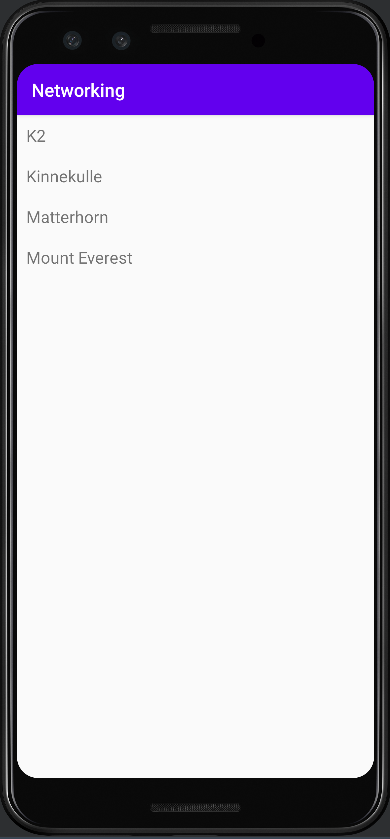

# Rapport

The RecyclerView was added to the layout by creating a RecyclerView element with standard attributes
such as id, constraints, height, and width. The element can be seen below.


```
    <androidx.recyclerview.widget.RecyclerView
        android:id="@+id/recycler_view"
        android:layout_width="match_parent"
        android:layout_height="match_parent"
        app:layout_constraintBottom_toBottomOf="parent"
        app:layout_constraintLeft_toLeftOf="parent"
        app:layout_constraintRight_toRightOf="parent"
        app:layout_constraintTop_toTopOf="parent" />
```

Another layout file was created to structure list items within the RecyclerView. 
Inside this layout file (list_item.xml) a TextView is created to represent data. 
This TextView gets attributes such as id, text size, height, and width (however, no constraints due 
to it being placed within a linear layout). Parts of the code from the xml file can be seen below.

```
<?xml version="1.0" encoding="utf-8"?>
<LinearLayout xmlns:android="http://schemas.android.com/apk/res/android"
    . . .
    <TextView
        android:id="@+id/title"
        android:layout_width="wrap_content"
        android:layout_height="wrap_content"
        android:textSize="18sp"/>
</LinearLayout>
```

A class (RecyclerViewItem.java) is also created to represent the RecyclerView item in java. 
This class mainly consists of a string and a getter. The class can be seen below. 

```
. . .
@SuppressWarnings("WeakerAccess")
public class RecyclerViewItem {
    private String title;
    public RecyclerViewItem(String title) {
        this.title = title;
    }
    public String getTitle() {
        return title;
    }
}
```

An arraylist is created to be shown in the RecyclerView. Initially, this array is only declared and 
left empty before the JSON data is fetched. 
An adapter is then created as its own class (RecyclerViewAdapter.java). An instance of this class is 
created in MainActivity and assigned to a variable. The RecyclerView from the layout file also 
gets referenced and stored as a variable. The RecyclerView then gets its own layout manager and is 
tied to the adapter. Parts of the code for this can be seen below.

MainActivity.java
```
@SuppressWarnings("FieldCanBeLocal")
public class MainActivity extends AppCompatActivity implements JsonTask.JsonTaskListener {
    . . .
    private  RecyclerViewAdapter adapter;
    ArrayList<RecyclerViewItem> items = new ArrayList<>();
    . . .
    @Override
    protected void onCreate(Bundle savedInstanceState) {
        . . .
        adapter = new RecyclerViewAdapter(this, items);
        RecyclerView recyclerView = findViewById(R.id.recycler_view);
        recyclerView.setLayoutManager(new LinearLayoutManager(this));
        recyclerView.setAdapter(adapter);
        . . .
    }
. . .
}
```

A ViewHolder class (MyViewHolder.java) is also created to hold a reference to the TextView inside 
the RecyclerView. Code for the ViewHolder class is shown below. 

```
. . .
public class MyViewHolder extends RecyclerView.ViewHolder  {

    TextView titleView;
    public MyViewHolder(@NonNull View itemView) {
        super(itemView);
        titleView = itemView.findViewById(R.id.title);
    }
}
```

This ViewHolder is used for methods within the adapter class to make sure the layout inflates
the required amount and sets text inside the views. These methods (inside RecyclerViewAdapter.java) can be seen below.
```
. . .
    @NonNull
    @Override
    public MyViewHolder onCreateViewHolder(@NonNull ViewGroup parent, int viewType) {
        return new MyViewHolder(LayoutInflater.from(context).inflate(R.layout.list_item, parent, false));
    }

    @Override
    public void onBindViewHolder(@NonNull MyViewHolder holder, int position) {
        holder.titleView.setText(items.get(position).getTitle());
    }
```

To fetch the JSON data, a JsonTask class is created. In MainActivity, the JSON URL is fetched and 
stored in a variable. In OnCreate() (from MainActivity), a new instance of the JsonTask is created 
to pass the URL and use it to fetch the actual JSON data. This is an async process, meaning it takes
place in the background whilst other code is executed. Code for fetching the URL and passing it to 
the JsonTask instance can be seen below.

MainActivity.java
```
@SuppressWarnings("FieldCanBeLocal")
public class MainActivity extends AppCompatActivity implements JsonTask.JsonTaskListener {
    . . .
    private final String JSON_URL = "https://mobprog.webug.se/json-api?login=brom";
    
    @Override
    protected void onCreate(Bundle savedInstanceState) {
    . . .
        new JsonTask(this, this).execute(JSON_URL);
    }
. . .
}
```

Another java class is created to correspond to the JSON data about mountains. The class gets a
variable for every attribute a mountain possesses in the JSON data, such as name, type, id.  
Getters are also created for these variables. Additionally, another class is also created to 
correspond to the auxdata attribute which consists of two values. Code for the mountain class 
can be seen below. Some variables have names that differ from the JSON data, this is made possible 
due to @SerializedName(). 

```
. . .
public class Mountain {
    @SerializedName("ID")
    private String id;
    private String name;
    private String type;
    private String company;
    private String location;
    private String category;

    @SerializedName("size")
    private int meters;

    @SerializedName("cost")
    private int feet;
    private Auxdata auxdata;
    . . .
    @Override
    public String toString() { return name; }
}
```

Back to MainActivity, GSON is used in onPostExecute() to deserialize the JSON data and make it into 
an array of mountain objects (from mountain class). Finally, using a for-loop, the arraylist gets 
filled with the names from these mountain objects. notifyDataSetChanged() is then used to notify the
adapter of this change in the arraylist, this causes it to update and display the new items on 
the screen. Code for this can be seen below. 

```
    @Override
    public void onPostExecute(String json) {
    
        Log.d("MainActivity", json);
        Gson gson = new Gson();
        Mountain[] mountains = gson.fromJson(json, Mountain[].class);

        for (int i=0; i<mountains.length; i++) {
            items.add(new RecyclerViewItem(mountains[i].toString()));
        }
        adapter.notifyDataSetChanged();
    }
```

The result can be seen in the following screenshot. 


